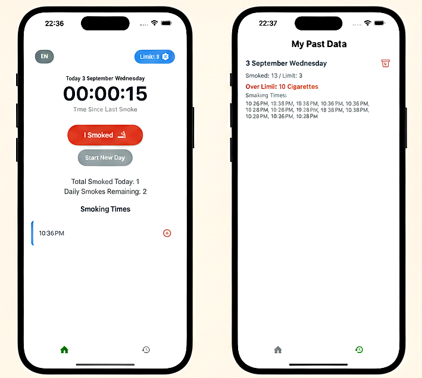

1. Install dependencies

   ```bash
   npm install
   ```

2. Start the app

   ```bash
   npx expo start
   ```

      A simple and effective mobile application built with Expo and React Native to help you track your daily cigarette consumption. 
      
      Daily Tracking: Easily log each cigarette you smoke with a single tap.
      
      Customizable Daily Limit: Set a personal daily limit to help you reduce your consumption.
      
      Time Since Last Smoke: See how long it's been since your last cigarette, providing motivation to delay the next one.
      
      Comprehensive History: Review your smoking habits over time with a detailed history log.
      
      Multi-language Support: The app supports both English and Turkish, with a simple toggle button for language selection.
      
      Data Persistence: Your data is securely saved on your device, so you don't lose your progress when you close the app.
      
      
